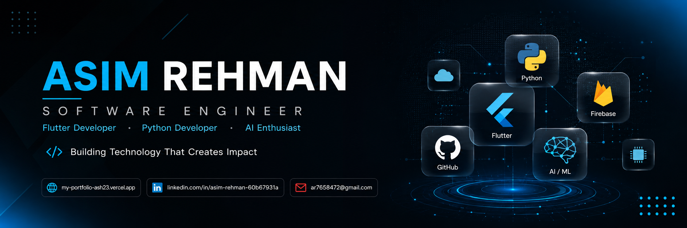

  

<h1 align="center">Welcome to my GitHub</h1>

<h3 align="center">
Software Engineer • Python Developer • Flutter Developer • AI Enthusiast
</h3>

  
  &nbsp;&nbsp;&nbsp;
  <a href="https://www.linkedin.com/in/asim-rehman-60b67931a/" target="_blank">
    <https://img.shields.io/badge/LinkedIn-0A66C2?style=for-the-badge&logo=linkedin&logoColor=white>
  </a>
  &nbsp;&nbsp;&nbsp;
  

---
