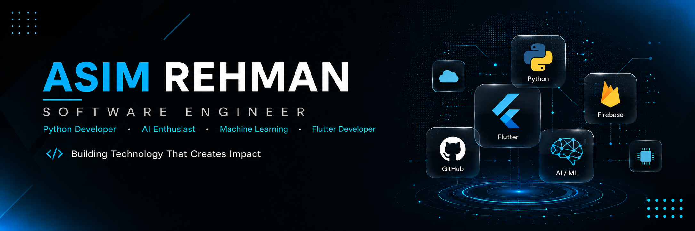

  

<h1 align="center">Welcome to my GitHub</h1>
<h3 align="center">
Software Engineer • Machine Learning enthusiast • Python Developer • Flutter Developer 
</h3>

---

### 👋 About Me

Machine Learning enthusiast with hands-on experience building AI-powered systems, including a Generative AI chatbot
developed during an internship at the National Incubation Center. Proficient in Python, scikit-learn, and data analysis
(NumPy, Pandas, Matplotlib), with practical exposure to computer vision fundamentals (OpenCV) and backend
development using FastAPI. Strong foundation in software engineering principles, with a track record of independently
designing and deploying complete, production-ready applications. Analytical problem-solver eager to apply ML/AI skills
to real-world data-driven challenges

---

### 🛠️ Tech Stack

---

### 🚧 Featured Projects

<table>
<tr>
<td width="50%" valign="top">

**🌱 AgroSense** : *Featured · IoT + Agriculture + Mobile*
An intelligent agricultural monitoring system using IoT sensors to monitor environmental conditions and help farmers protect high-value crops through real-time insights and automation.

`Flutter` `Firebase` `IoT` `ESP32` `MicroPython`

</td>
<td width="50%" valign="top">

**🤖 AI Chatbot System** : *Artificial Intelligence*
Custom chatbot built using Python and machine learning, with training pipelines, model checkpoints, and NLP processing for intelligent conversation.

`Python` `NLP` `Machine Learning`

</td>
</tr>
<tr>
<td width="50%" valign="top">

**📱 Nokia Keypad Encoder** : *Python Application*
A custom encoding and decoding system inspired by classic Nokia T9 keypad technology, converting text into numerical sequences and vice versa.

`Python` `Algorithms` `Data Structures`

</td>
<td width="50%" valign="top">

**⬇️ YouTube Downloader** : *Desktop Application*
A Python desktop app for downloading audio and video content in multiple formats through an intuitive graphical interface.

`Python` `GUI` `yt-dlp`

</td>
</tr>
<tr>
<td width="50%" valign="top">

**🎓 Student Record Re-Engineering** : *Software Engineering*
Analysis and redesign of a traditional student record system using software re-engineering techniques — process modeling, DFDs, ERDs, and system optimization.

`Software Engineering` `System Analysis` `Database Design`

</td>
</tr>
</table>

<em>🔒 Source code for most projects is available upon request, feel free to reach out!</em>

---

### 📈 GitHub Stats

